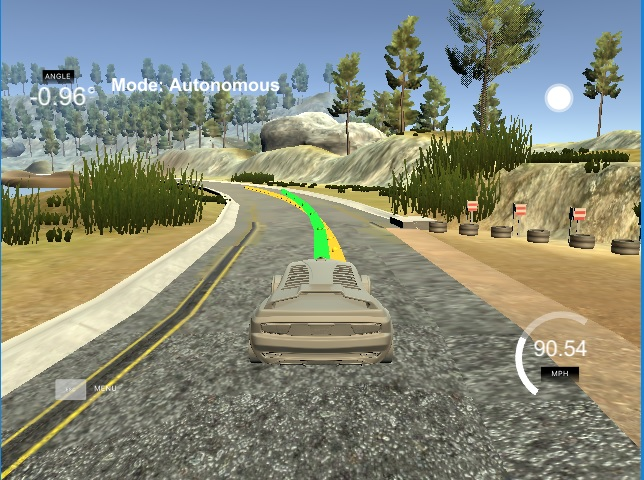

## Model Predictive Control Project

Overview:
---

Model Predictive Control(MPC) as a more advanced non-linear type controller. An MPC type of controller is capable of dealing with physical constraints such as the time needed for actuators(actutator delay) to reach the required output. In the case of a vehicle, an MPC algorithm predicts the position of the vehicle ahead of time, calculates the expected error and send control signals to the actuators to compensate the steering or speed.

Tools and Techniques:
---

* Implemented in C++
* Non-linear control techniques

Reflections:
---

An MPC is a very powerful controller that can compensate for situations in which a PID may not suffice.

The downside of MPC is that is not so easy to implement, a high level of mathematics and deep understanding of non-linear control is needed in order to understand how the solver works.

